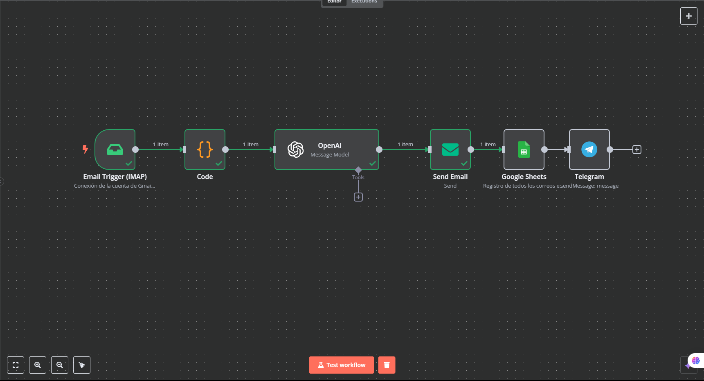
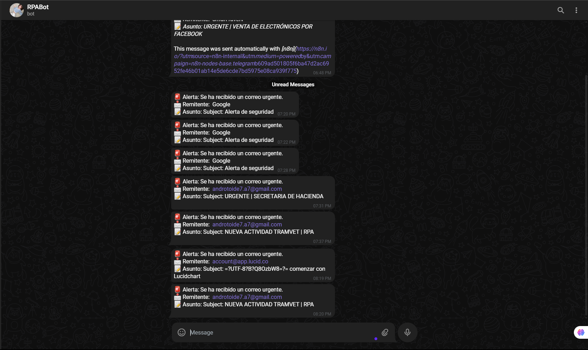

# Automatización de respuestas a correos entrantes N8N-RPA
Este proyecto implementa una solución de automatización de procesos robóticos (RPA) utilizando N8N.

# Automatización de Clasificación y Respuesta de Correos con N8N

Este proyecto implementa un flujo de automatización (RPA) en [N8N](https://n8n.io/) para clasificar correos electrónicos entrantes, generar respuestas automáticas usando IA (OpenAI GPT-4o-mini), registrar datos en Google Sheets y notificar urgencias vía Telegram.

## Descripción

El flujo escucha correos en una cuenta IMAP (Gmail empresarial), los analiza con IA para clasificarlos en categorías ("urgente", "consulta", "facturación", "general"), genera respuestas personalizadas, las envía al remitente, registra los detalles en una hoja de Google Sheets y envía alertas por Telegram si el correo es urgente.
Este proyecto implementa una solución de automatización de procesos robóticos (RPA) utilizando n8n, diseñada para gestionar correos electrónicos entrantes de manera eficiente. El sistema escucha correos en una cuenta empresarial de Gmail a través de IMAP, los clasifica automáticamente en categorías ("urgente", "consulta", "facturación" o "general") y asigna prioridades ("alta", "media" o "baja") utilizando el modelo de inteligencia artificial GPT-4o-mini de OpenAI. A partir del análisis, genera respuestas personalizadas y educadas en el idioma del remitente.

Posteriormente, el flujo envía la respuesta al remitente original mediante SMTP, registra los detalles del correo (remitente, asunto, categoría, prioridad y fecha) en una hoja de Google Sheets para seguimiento, y, en caso de que el correo sea clasificado como "urgente", envía una notificación inmediata a un chat de Telegram con información relevante.

El proyecto está diseñado para optimizar la gestión de correos electrónicos, reducir el tiempo de respuesta y mejorar la trazabilidad de las comunicaciones, siendo ideal para entornos empresariales que requieren automatización basada en APIs y procesamiento inteligente de texto.

## Requisitos previos

- **n8n**: Instancia local (Docker) o en n8n Cloud.
- **Cuentas y credenciales**:
  - IMAP (Gmail) para leer correos.
  - SMTP para enviar correos.
  - OpenAI API para clasificación y respuestas.
  - Google Sheets API para registro.
  - Telegram API para notificaciones.
- **Node.js**: Para ejecutar n8n localmente (si no usas Docker).

# Instalar N8N (opción Docker):
docker run -it --rm --name n8n -p 5678:5678 -v n8n_data:/home/node/.n8n docker.n8n.io/n8nio/n8n

## Importar el flujo:
Copia el contenido del archivo GmailRPAN8N.json.
En la interfaz de n8n (http://localhost:5678), ve a "Workflows" > "Import from File" y pega el JSON.
Configurar credenciales:
Añade las credenciales para IMAP, SMTP, OpenAI, Google Sheets y Telegram en la sección "Credentials" de N8N.

# Flujo de trabajo
Email Trigger (IMAP): Escucha correos entrantes en la cuenta configurada.
Code: Extrae datos del correo y genera un prompt para OpenAI.
OpenAI: Clasifica el correo y genera una respuesta usando GPT-4o-mini.
Send Email: Envía la respuesta al remitente.
Google Sheets: Registra los detalles del correo en una hoja de cálculo.
Telegram: Envía una notificación si el correo es "urgente".

# Estructura del proyecto
workflow.json: Definición del flujo de trabajo en formato JSON.
README.md: Este archivo.

# Uso
Activa el flujo en n8n ("Active: true" en el JSON o manualmente en la UI).
Envía un correo a la cuenta IMAP configurada para probar el flujo.
Verifica la respuesta, el registro en Google Sheets y la notificación en Telegram (si aplica).

# Limitaciones
No interactúa con interfaces gráficas (usa APIs exclusivamente).
Depende de la disponibilidad de las APIs externas (OpenAI, Google, etc.).
Lógica compleja limitada al nodo Code.

# Contribuciones
¡Las contribuciones son bienvenidas! Por favor, abre un issue o un pull request en este repositorio.

# Autores
Apolo Reynoso - Erick González Gómez
